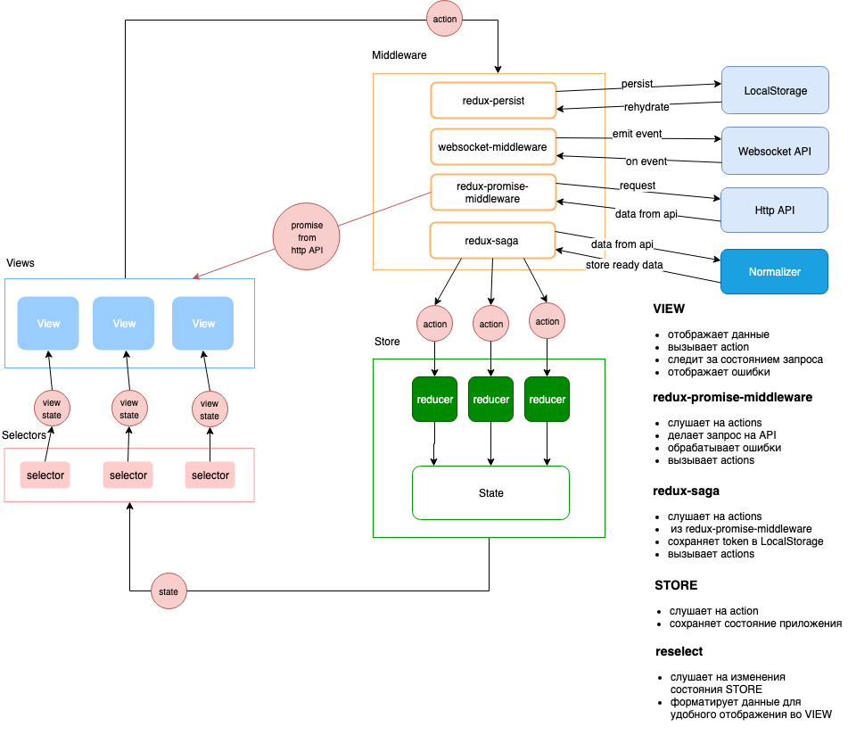

# Partymaker
[working example](https://partymaker.zp.ua)

This is a pet project where I and my friend experiment with new technologies and try new approaches in frontend development

1. React.js
2. Server side rendering
3. Redux
4. Material Design
5. Manual webpack configuration
6. Selectors
7. React router
8. WebSockets

## Setup

Install npm packages using npm or yarn

```bash
yarn install
```

Create your own environment file from example

```bash
cp .env.example .env
```
Use the npm or yarn to start the project

```bash
yarn start
```

## How everything works

